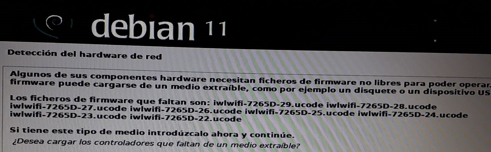

# debian 11 
Error en detectar el hardware de red.

## Solución: 

1. Descargar el siguiente archivo [firmware-iwlwifi](firmware/firmware-iwlwifi_20190114-2_all.deb).

2. Ir a la usb booteable donde se encuentra debian 11.

3. Buscar la carpeta llamada __firmware__ y pegar el archivo descargado.

4. Volver a instalar.

 
